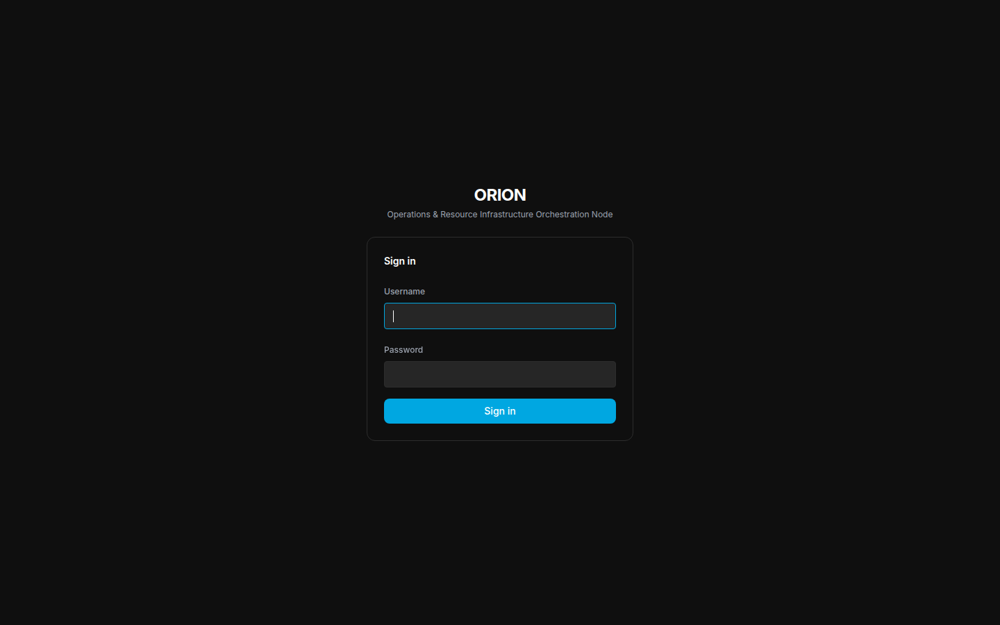
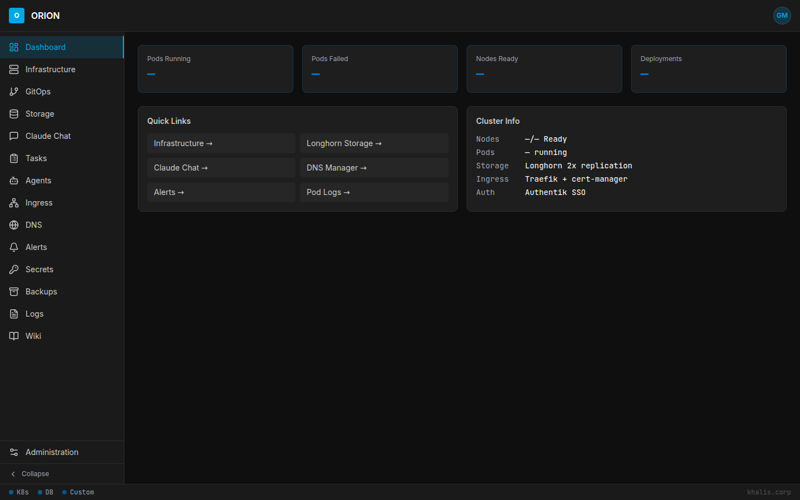
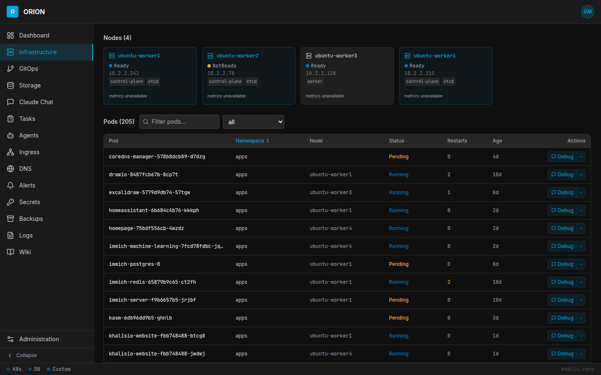
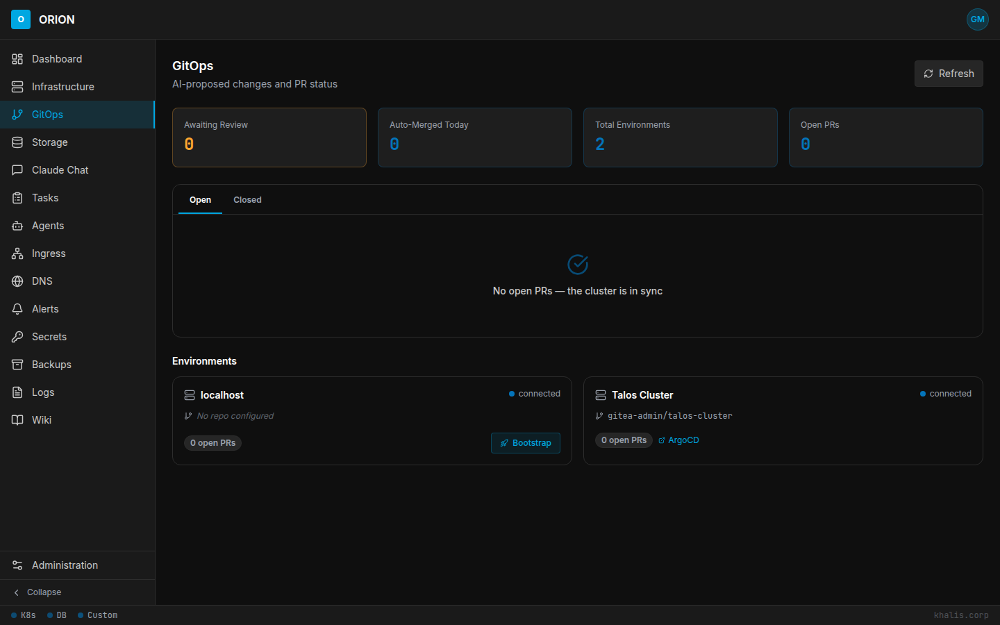
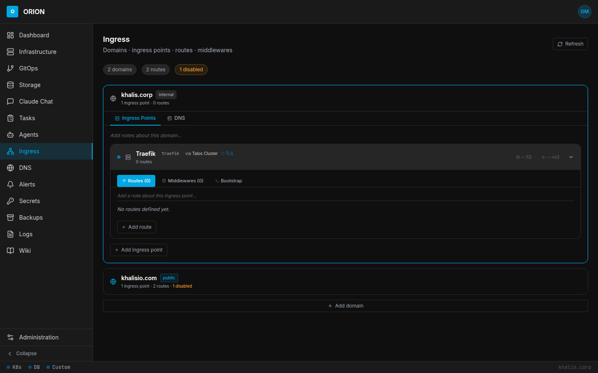
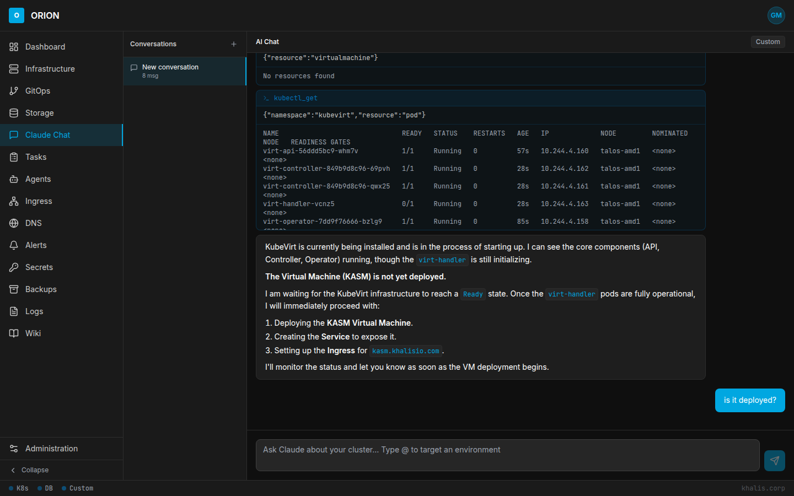
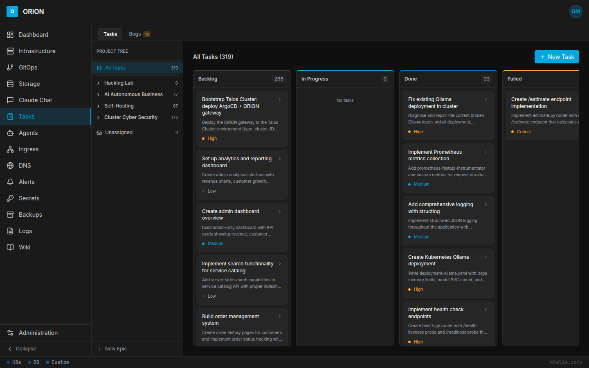

# ORION

**Operations & Resource Infrastructure Orchestration Node**

ORION is a self-hosted management platform that lives *outside* the infrastructure it controls. It bootstraps, manages, and automates Kubernetes clusters and Docker hosts through an AI-driven GitOps pipeline — and monitors them in real time through a built-in SIEM. When your cluster goes down, your management plane stays up.

---

## Screenshots

| | |
|---|---|
|  |  |
| **Login** | **Dashboard** |
|  |  |
| **Infrastructure — nodes & pods** | **GitOps — PR tracking & environments** |
|  |  |
| **Ingress Manager** | **Claude Chat** |
|  |  |
| **Tasks — kanban board** | **Security Dashboard** |

---

## How It Works

ORION runs on a dedicated management node (a Raspberry Pi 4 8GB works great). On first boot it spins up its own dependencies, then you register environments through the UI. From that point on, every infrastructure change flows through Git and every security event flows into the SIEM.

```
GitHub
  └── ORION (this repo) ──docker pull──► Management Node
                                              │
                              ┌───────────────┼───────────────┐
                              │               │               │
                           Gitea           Vault          CoreDNS
                        (source of       (secrets)    (your internal
                          truth)                          domain)
                              │
                    ┌─────────┴──────────┐
                    │                    │
             Kubernetes             Docker Host
              Cluster                   │
                    │              ORION Gateway        Falco
             ArgoCD + ORION        (Docker type)    (host syscalls)
              Gateway              + Gitea Actions       │
           (cluster type)               │           Falcosidekick
                    │                   │                │
              GitOps sync           Vector ─────────────┘
           manifests → cluster    (journald, Docker                 │
                                   events, Vault audit)    ORION Security API
                                                           (normalise → DB → UI)
```

**The AI GitOps loop:**

1. AI agent (via ORION) decides a change is needed
2. ORION writes to Gitea via REST API — creates branch, commits manifest, opens PR
3. PR is tagged `auto-merge` or `needs-review` based on operation type
4. Auto-merge operations merge immediately → ArgoCD detects → syncs to cluster
5. Review operations wait for human approval in Gitea → then ArgoCD syncs
6. ORION Gateway (MCP server inside the cluster) reports sync status back to ORION
7. Full audit trail — every cluster change is a Gitea commit with AI reasoning attached

**The security event pipeline:**

1. Falco captures syscall-level events on the management node (shells in containers, file reads, network anomalies)
2. Falcosidekick forwards each alert to the ORION webhook with retries and environment attribution
3. Vector ships journald auth events, Docker lifecycle events, and Vault audit logs in batches
4. K8s events poller pulls audit events from each registered cluster environment
5. All sources are normalised into `SecurityEvent` rows; the correlator groups them into `Incident`s
6. The security dashboard shows live incidents, alerts, source health, and Warden-generated action approvals

---

## Features

- **Self-bootstrapping** — one command starts everything; ORION spins up Gitea, Vault, PostgreSQL, CoreDNS, and Traefik automatically on first boot
- **First-run wizard** — configure your admin account, internal domain, public domain, and AI provider interactively; no hardcoded values
- **Multi-environment** — register Kubernetes clusters or Docker hosts; each gets an isolated Gitea repo, Vault secret path, and auth policy
- **AI-driven GitOps** — AI agents propose changes as Git PRs; configurable auto-merge policy per environment
- **Pluggable AI providers** — Anthropic API key, Claude Code OAuth, OpenAI, Ollama, or any OpenAI-compatible endpoint; swap without code changes
- **Secrets management** — single Vault instance serves all environments with full isolation via path + auth method per environment
- **Internal DNS** — CoreDNS on the management node is authoritative for your internal domain; configured via the first-run wizard
- **Cluster bootstrap** — register a cluster and ORION automatically deploys ArgoCD, ESO, and the ORION Gateway
- **MCP gateway** — ORION Gateway exposes kubectl/Docker tools to AI agents via the Model Context Protocol
- **Built-in SIEM** — Falco, CrowdSec, Wazuh, and Vector ship events to a normalised pipeline; incidents are correlated automatically and surfaced in the security dashboard
- **Vulnerability scanning** — Trivy scans container images on pull and on a daily schedule; CVE findings are enriched and linked to environments
- **Warden agent** — AI security operator that reviews incidents, proposes remediations, and queues actions for human approval

---

## Stack

| Component | Role |
|---|---|
| **ORION Web** | Next.js 15 dashboard + API + AI agent orchestrator |
| **ORION Gateway** | MCP server deployed inside each managed environment |
| **Gitea** | Self-hosted Git — one repo per registered environment |
| **Vault** | Secrets store with per-environment isolation |
| **PostgreSQL 16** | ORION database (pgvector enabled) |
| **Traefik** | Reverse proxy for management node services |
| **CoreDNS** | Authoritative DNS for your internal domain |
| **Falco** | Syscall-level runtime security on the management host |
| **Falcosidekick** | Forwards Falco alerts to ORION with HMAC auth and retries |
| **Vector** | Ships journald, Docker events, and Vault audit logs to ORION |
| **Redis Sentinel** | HA Redis cluster for distributed rate limiting |
| **MinIO** | S3-compatible audit log archival |

---

## Auto-Merge Policy

Operations are classified at PR creation time. Policy is configurable per environment.

| Operation | Default |
|---|---|
| Scale replicas, rolling restart | ✅ Auto-merge |
| Image tag update (patch/minor) | ✅ Auto-merge |
| ConfigMap update, resource limits | ✅ Auto-merge |
| New deployment, service, ingress | 👤 Human review |
| RBAC, network policies, namespaces | 👤 Human review |
| Secrets, destructive operations | 👤 Human review |

---

## Quick Start

### Prerequisites

- Docker + Docker Compose on your management node
- ARM64 or amd64 architecture (Raspberry Pi 4/5 or any Linux box)
- A static IP for your management node

### 1. Clone and configure

```bash
git clone https://github.com/richard-callis/orion-web.git
cd orion-web/deploy
cp .env.example .env
# Edit .env — set MANAGEMENT_IP and POSTGRES_PASSWORD at minimum
```

### 2. Bootstrap

```bash
./bootstrap.sh
```

On first run this will:
- Pull all images
- Start the full stack
- Print a one-time setup token to the logs

### 3. Complete setup

Visit `http://<your-management-ip>:3000`, paste the setup token, and follow the first-run wizard:

1. **Admin account** — set your username and password
2. **Domain configuration** — set your internal domain (e.g. `home.lab`), public domain, and management node IP; ORION configures CoreDNS and Traefik automatically
3. **AI provider** — choose Anthropic, OpenAI, Ollama, or a custom endpoint
4. **Vault init** — ORION initializes Vault and displays your unseal keys; store these safely

### 4. Register an environment

In the ORION UI, go to **Environments → Add Environment** and select:

- **Kubernetes** — provide a kubeconfig; ORION deploys ArgoCD, ESO, and the ORION Gateway
- **Docker** — provide a Docker socket or TCP endpoint; ORION deploys the ORION Gateway and a Gitea Actions runner

---

## Repository Structure

```
orion-web/
├── apps/
│   ├── web/                    # ORION dashboard (Next.js 15 + Prisma + TypeScript)
│   │   └── src/
│   │       ├── app/            # Next.js app router (API routes + pages)
│   │       ├── components/     # UI components (security dashboard, infrastructure, etc.)
│   │       ├── jobs/           # Background pollers (K8s events, ELK, ntopng, vuln scan)
│   │       ├── lib/            # Shared libraries
│   │       │   └── security/   # SIEM pipeline: normalizers, correlator, rule engine
│   │       └── workers/        # Security correlator worker
│   └── gateway/                # ORION Gateway MCP server (Express + TypeScript)
├── deploy/
│   ├── docker-compose.yml      # Full management node stack
│   ├── bootstrap.sh            # First-run setup script
│   ├── .env.example            # Environment variable template
│   ├── coredns/                # CoreDNS config + zone files
│   └── host-agent/
│       ├── falco/falco.yaml    # Falco runtime security config
│       └── vector.toml         # Vector telemetry shipper config
└── .github/workflows/          # Multi-arch builds (amd64 + arm64) → ghcr.io
```

---

## CI/CD

Pushing to `main` triggers GitHub Actions that build multi-arch Docker images (`linux/amd64` + `linux/arm64`) and push to the GitHub Container Registry:

- `ghcr.io/richard-callis/orion-web:latest`
- `ghcr.io/richard-callis/orion-gateway:latest`

> **Note:** Enable write permissions for packages in repo Settings → Actions → General → Workflow permissions → Read and write.

---

## Environment Variables

| Variable | Description | Default |
|---|---|---|
| `MANAGEMENT_IP` | Static IP of the management node | — |
| `ORION_DOMAIN` | Domain for the ORION UI | `orion.internal` |
| `GITEA_DOMAIN` | Domain for Gitea | `gitea.internal` |
| `VAULT_DOMAIN` | Domain for Vault UI | `vault.internal` |
| `POSTGRES_PASSWORD` | PostgreSQL password | — |
| `NEXTAUTH_SECRET` | NextAuth secret (generate with `openssl rand -base64 32`) | — |
| `ORION_VERSION` | Image tag to deploy | `latest` |
| `FALCO_WEBHOOK_SECRET` | Shared token — Falcosidekick → ORION Falco webhook | — |
| `HOST_AGENT_WEBHOOK_SECRET` | HMAC secret — Vector → ORION host-agent webhook | — |
| `CROWDSEC_WEBHOOK_SECRET` | HMAC secret — CrowdSec → ORION webhook | — |
| `WAZUH_WEBHOOK_SECRET` | HMAC secret — Wazuh → ORION webhook | — |
| `ELK_URL` | ELK/Elasticsearch base URL for the ELK poller | — |
| `NTOPNG_URL` | ntopng API base URL for the ntopng poller | — |

> Domains are bootstrap defaults only — the first-run wizard lets you configure your actual internal and public domains interactively.
> Security webhook secrets are generated by `bootstrap.sh` and written to `.env` automatically.

See `deploy/.env.example` for the full list.

---

## Architecture Notes

- **Management plane is external** — ORION runs outside the clusters it manages; cluster outages don't affect the management node
- **ORION's source of truth is GitHub** — Gitea manages cluster repos; ORION's own code lives here to avoid a circular dependency
- **One Vault, N environments** — secret paths and auth methods are scoped per environment; cross-environment access is impossible by policy
- **CoreDNS is authoritative** — ORION configures CoreDNS for your internal domain during setup; cluster CoreDNS instances forward to it; internal DNS survives cluster outages
- **SIEM is pull and push** — push-based sources (Falco, CrowdSec, Wazuh, Vector) POST events to ORION webhooks; pull-based sources (K8s events, ELK, ntopng) are polled on configurable intervals from the worker process
- **Portable** — no hardcoded domains, IP ranges, or cloud provider assumptions; works on any network with any internal domain

---

## License

MIT
